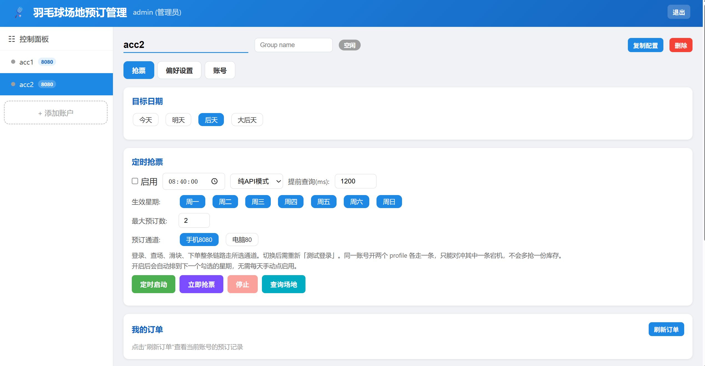
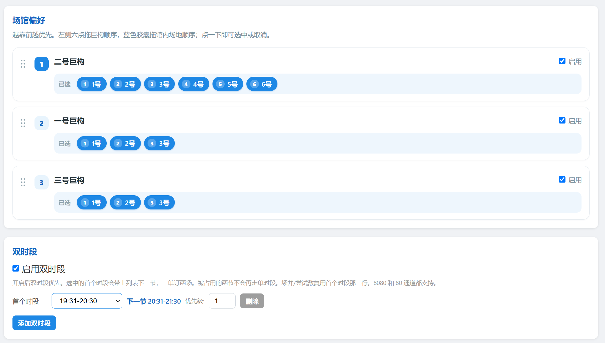

# 西安交通大学羽毛球场地预约管理系统

一个面向西安交通大学羽毛球场地预约场景的本地 Web 管理工具。项目使用 FastAPI、Vue 3、SQLite 和 APScheduler，支持多账号管理、CAS 登录、场地查询、定时预约、滑块识别、订单查询与实时日志。

> 本项目仅供学习、研究与个人使用。请遵守学校场馆预约规则，并妥善保护个人账号信息。



## 主要功能

- 管理员与普通用户两类角色，支持邀请码注册、账号分组和配置复制。
- 支持一号、二号、三号巨构的场馆顺序、场地顺序和时段优先级设置。
- 支持单时段尝试数、同一时段并发数、最大预约数和双时段预约。
- 支持手机 8080、电脑 80 两套预约通道。
- 支持按星期常驻调度，服务重启后自动恢复下一次任务。
- 提前 12 小时准备候选池，正式预约时刻不再依赖临场查询。
- 支持查场、页面直接预订、订单查询、最近三天结果和历史日志。
- 使用 OpenCV 在本地识别滑块，无需启动独立识别服务。

## 项目结构

```text
Badminton_booking_system_for_XJTU/
├── web_platform/
│   ├── main.py                 # FastAPI、REST API、WebSocket
│   ├── booking_engine.py       # 核心预约流程
│   ├── scheduler.py            # 定时任务与预约前流水线
│   ├── candidate_pool.py       # 候选池：默认成员、查询结果合并
│   ├── database.py             # SQLite 数据访问
│   ├── dual_slot.py            # 双时段与优先级逻辑
│   ├── log_manager.py          # 实时及历史日志
│   └── static/index.html       # Vue 3 Web UI
├── cas_http/                   # CAS 登录与场馆 HTTP API
├── slider_match/               # OpenCV 滑块匹配
├── docs/
│   └── images/                 # README 界面截图
│       ├── booking-dashboard.png
│       └── preference-settings.png
└── README.md
```

## 快速开始

环境要求：Windows 10/11、Python 3.10+，并能访问西安交大 CAS 与场馆服务。

在项目根目录执行：

```bat
web_platform\start.bat
```

脚本会安装依赖并启动 8000 端口，随后访问：

```text
http://localhost:8000
```

也可以手动启动：

```powershell
cd web_platform
python -m pip install -r requirements.txt
python main.py
```

程序默认管理员账号和密码均为 `admin`。首次启动前建议修改：

```powershell
$env:BOOKING_ADMIN_USERNAME = "your-admin-name"
$env:BOOKING_ADMIN_PASSWORD = "use-a-strong-password"
cd web_platform
python main.py
```

页面从 `unpkg.com` 加载 Vue 3；如果页面空白，请先检查浏览器能否访问该 CDN。

## 使用流程

1. 管理员登录后直接添加账号，或生成一次性邀请码供普通用户注册。
2. 在“账号”页测试 CAS 登录，并选择手机 8080 或电脑 80 通道。
3. 设置目标日期、场馆和场地顺序、时段、尝试数与并发数。
4. 设置执行时间和生效星期，启用常驻调度或点击“定时启动”。
5. 通过实时日志观察执行过程，并在“我的订单”中核对最终结果。

关键配置：

| 配置项 | 含义 |
| --- | --- |
| 目标日期 | 相对今天的天数；自动预约当前只使用所选列表第一项，默认两天后。 |
| 场馆/场地顺序 | 数值越小越优先，候选按场馆优先级再按馆内场地优先级排序。 |
| 时段优先级 | 范围 1～5，较小优先级先执行，同级时段并行。 |
| 尝试数 | 一个时段最多尝试的候选场地数，范围 0～10。 |
| 场并 | 同一时段同时处理的候选数，范围 1～10；下单区段仍受账号级锁保护。 |
| 双时段 | 只配对连续两个时段中同一场馆、同一场地号，并在一个订单中提交。 |
| 提前查询 | 在正式预约前多少毫秒开始查场，界面范围 0～5000 ms。 |
| 预约通道 | 登录、查场、滑块和下单均走所选通道；切换后需要重新登录。 |



## 关键设计

### 预约前流水线

系统将耗时步骤前移，正式预约时刻只剩下单本身：

```text
排程/改配置   候选池 = 全部已勾选场地 × 已选时段，ID 未知
T-12h        查询目标日期，补齐 stockId/seatId，剔除明确不可约的场地；
             距 T 不足 12 小时时改为立即查询；仍有场地缺 ID 时每 120 秒重试，最多 3 次
T-150s       检查登录会话，失效立即重新登录；T-90s、T-30s 再各检查一次
T-6s         匿名并发获取并识别 6 份滑块验证码
T-Xms        匿名查场，并按 1 秒节拍继续轮询，最多 20 轮；成功结果合并进候选池
T=0          直接用候选池下单，不做阻塞查询
```

`X` 由“提前查询”控制。`T=0` 不重新登录也不再校验会话，直接使用最近一次登录检查留下的会话。临近 T 的查询失败、超时或未返回时，直接使用最近一次成功查询得到的候选池；只有池子里一个可约场地都没有时才最多等待 5 秒。

### 会话与查询隔离

每套配置拥有独立运行时状态。认证后的 `httpx.Client` 只用于订单与下单；高频查场和验证码请求使用匿名客户端池，避免争用认证会话。切换 8080/80 通道时会主动清除旧会话。

### 候选池

候选池只会因为服务器明确回答“不可约”而缩小。某个场馆查询失败或超时时，该场馆的场地保持上一次成功查询的状态；同一次查询中成功的场馆照常更新，被订走的场地会被剔除，之后恢复可约也会重新加入。修改场馆、时段或双时段勾选时按新选择重建池子，同一日期已知的 ID 保留。

并发查场可能出现“先请求、后返回”。结果按场馆、按请求开始时间应用，较旧查询不能覆盖较新结果；新排程会设置截止时间，阻止上一轮未完成的请求写入。

手机 8080 通道在 08:40～21:40 之外会把匿名查询重定向到错误页（这也是每天 08:40 之前查询全部失败的原因），电脑 80 通道全天可查，两边返回的 stockId/seatId 完全一致。因此某个场馆在当前通道查询失败时会自动改用另一个通道重试。

### 优先级、递补与双时段

时段按优先级分波次执行，同一波次中的任务并行。每个时段最多保留指定数量的并发尝试，失败后从最新快照中按场馆、场地顺序递补，直到成功、达到尝试数或触发官方限制。

双时段先计算两个连续时段的候选交集，只保留同馆同场的组合。被双时段占用的时间不会再走单时段路径，避免同一配置产生冲突订单。

### 滑块与日志

滑块图片在内存中完成 Base64 解码、OpenCV 模板匹配和坐标换算。预取结果有效期为 20 秒，每个验证码只消费一次；预取失效或识别失败时会切换到实时获取。

工作线程将日志写入线程安全队列，再由异步任务推送到 WebSocket。每套配置内存中保留最近 500 条日志，完整记录保存在：

```text
web_platform/logs/profile_<profile_id>_<时间>.log
```

## 数据与调度

本地数据库为 `web_platform/bookings.db`，保存账号配置、邀请码和按日期记录的预约结果；认证会话、验证码、候选池和具体调度任务只保存在内存中。

服务启动时会根据数据库中的启用状态、星期和执行时间重新计算下一次任务，距 T 不足 12 小时时会立即查询一次候选池。服务停止期间错过的任务不会补执行。

页面上的“下次执行”下方会显示候选池状态（可预约数、已勾选数、未获取 ID 数和最近一次成功查询时间），日志中以 `[Pool]` 开头的行是每次查询合并后的结果。

## 安全说明与限制

- CAS 凭据当前以明文保存在本地 SQLite 中，请勿上传 `bookings.db` 或将服务暴露给不可信网络。
- 默认管理员密码为 `admin`，部署前必须修改。
- 登录 Token 保存在进程内存，重启后失效；当前 WebSocket 端点尚未校验 Token。
- 后端默认监听 `0.0.0.0`，不建议直接部署到公网。如需远程使用，应增加 HTTPS、鉴权、凭据加密和限流。
- CAS 要求邮箱验证码等二次认证时，自动登录会失败；项目已移除二次验证码自动化。
- `schedule_mode` 当前仅作为兼容字段保存，核心流程尚未按 `api` / `mix` 分支执行。
- 官方接口、开放时间或认证流程变化时，需结合历史日志和官方页面排查。

## 测试

```powershell
cd web_platform
python -m unittest -v test_dual_slot test_candidate_pool
```

当前测试覆盖双时段配对、优先级波次、订单参数、订单详情，以及候选池的默认成员、查询合并、过期丢弃和重建保留。
